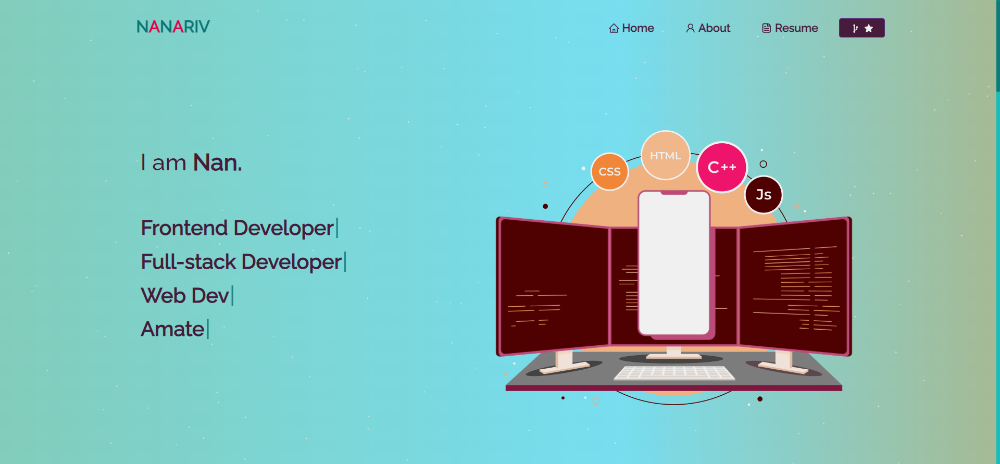

<h2 align="center">
  Portfolio Website 
  <a href="https://nanariv.vercel.app/" target="_blank">nanariv</a>
</h2>

  

 

 &nbsp;

This project was built using these technologies.

- React.js
- Node.js
- Express.js
- CSS3
- Vercel

Features

 - Styled with React-Bootstrap and Css with easy to customize colors
 - Fully Responsive - Currently being reworked

Getting Started

Clone down this repository. You will need `node.js` and `git` installed globally on your machine.

Installation and Setup Instructions

1. Installation: `npm install`

2. In the project directory, you can run: `npm start`

Runs the app in the development mode.\
Open [http://localhost:3000](http://localhost:3000) to view it in the browser.
The page will reload if you make edits.

Inspiration Credit:  <a href="https://github.com/soumyajit4419">Soumyajit4419.</a>
